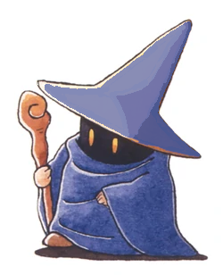

<!--
**MatthewAWBrown/MatthewAWBrown** is a ✨ _special_ ✨ repository because its `README.md` (this file) appears on your GitHub profile.

Here are some ideas to get you started:

- 🔭 I’m currently working on ...
- 🌱 I’m currently learning ...
- 👯 I’m looking to collaborate on ...
- 🤔 I’m looking for help with ...
- 💬 Ask me about ...
- 📫 How to reach me: ...
- 😄 Pronouns: ...
- ⚡ Fun fact: ...
-->

<h2> Salut! 👋</h2>

I am Matthew Brown, welcome to my GitHub README! 
Professional musician, Dungeon Master dilettante, and coffee enthusiast 
Follow me on Twitter for random thoughts on <i>Dungeons and Dragons</i> and <i>Final Fantasy XIV</i> <a href="https://twitter.com/AllMattNoMercer?ref_src=twsrc%5Etfw" class="twitter-follow-button" data-show-count="false">Follow @AllMattNoMercer</a>

***

<h2>Education</h2>

- <i>Prospective 2025 graduate:</i> Honours Bachelor of Science, Computer Science (Co-op) <b>Lakehead University</b>, Thunder Bay, Ontario
- <i>May - August 2021:</i> Bachelor of Science, Computing Information Systems <b>Athabasca University</b>, Online 
- <i>Graduated 2020:</i> Bachelor of Music <b>Mount Allison University</b>, Sackville, New Brunswick 

<h2>Completed and Current CS Courses</h2>

__Lakehead University__
- COMP-1411: Computer Programming I (C)
- COMP-1431: Computer Programming II (C++)
- COMP-2476: Intro to Assembly Lang & Op Sys (.masm)
- COMP-2430: Mobile Computing Technolgy (Flutter, Java, and SWIFT)

__Athabasca University__
- COMP 200: Intro to Computer Systems
- COMP 210: Intro to Info Sys & Comp Apps (Python)
- COMP 214: Interactive Technologies

***
<h2>Current and Future Pet Projects</h2>
I'm currently working on a small add-on odule for the FoundryVTT platform that supports Dungeons and Dragons 5th Edition.